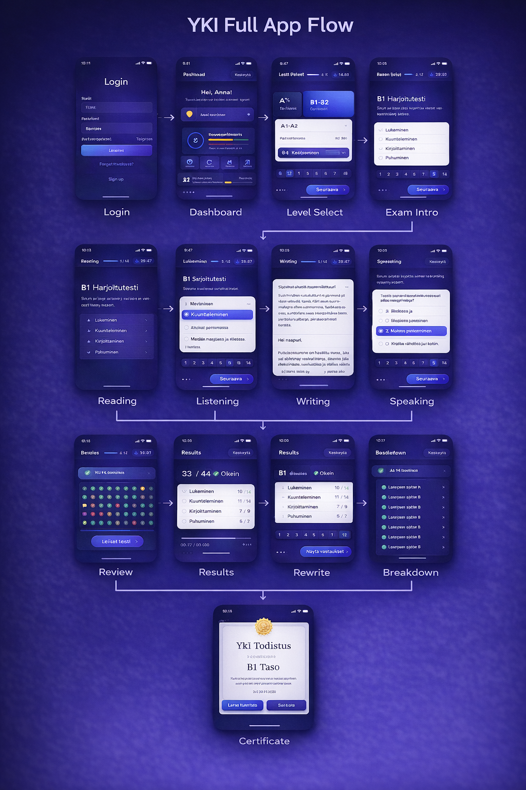
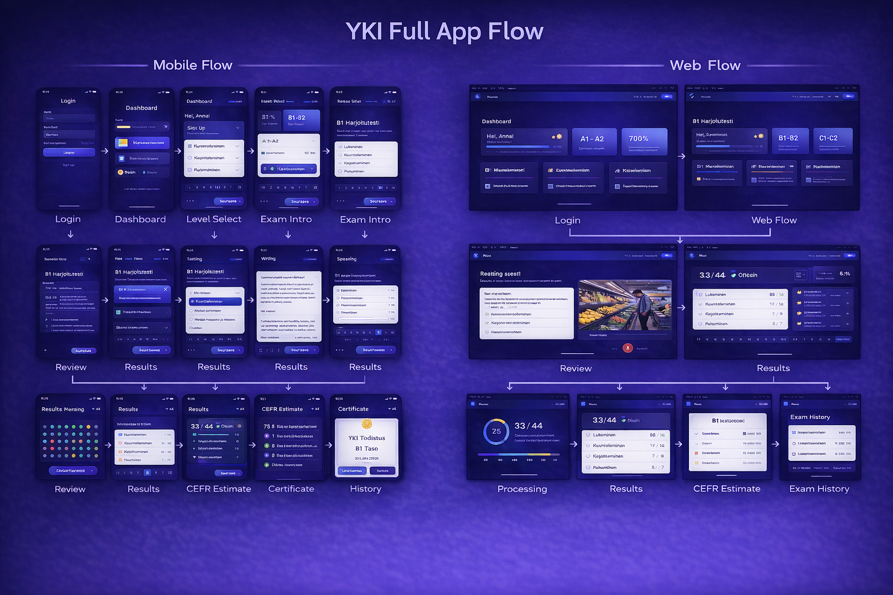
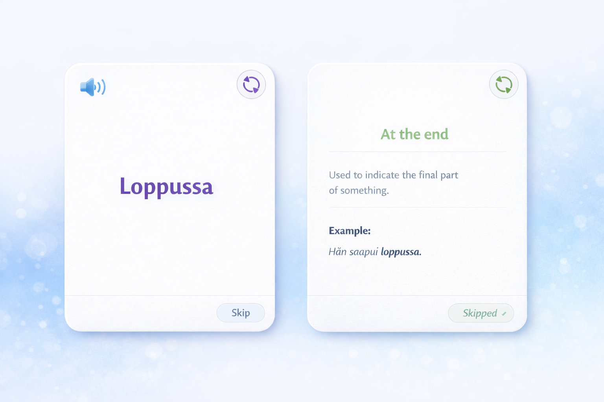
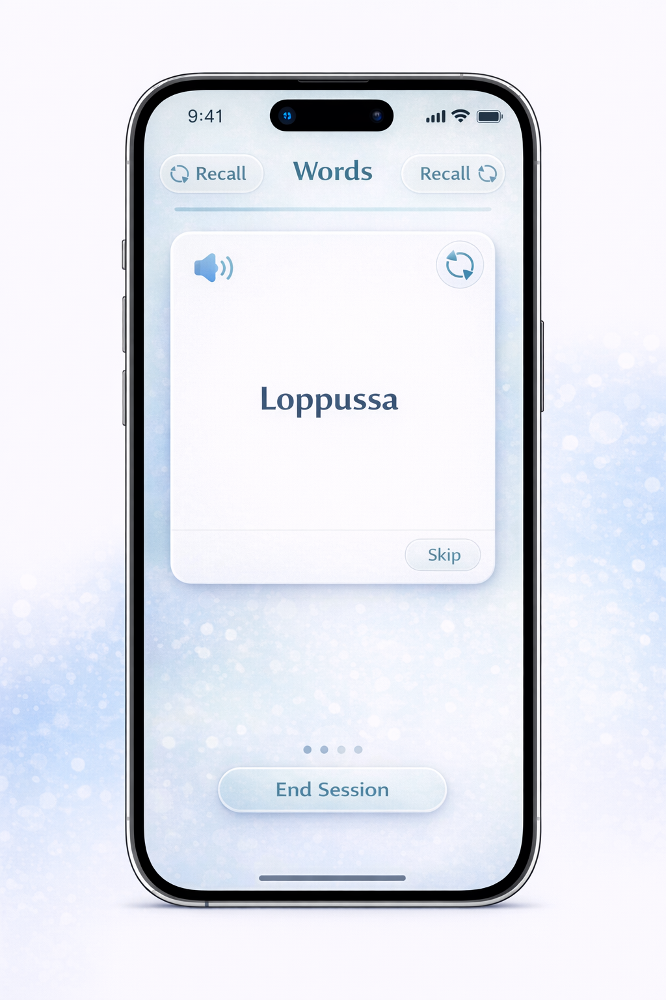
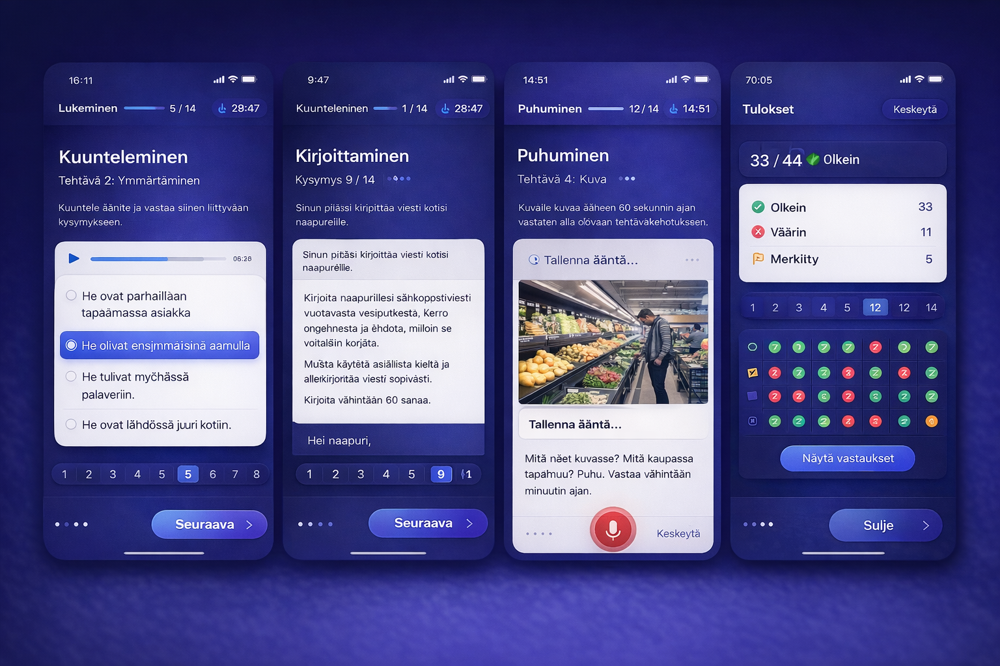
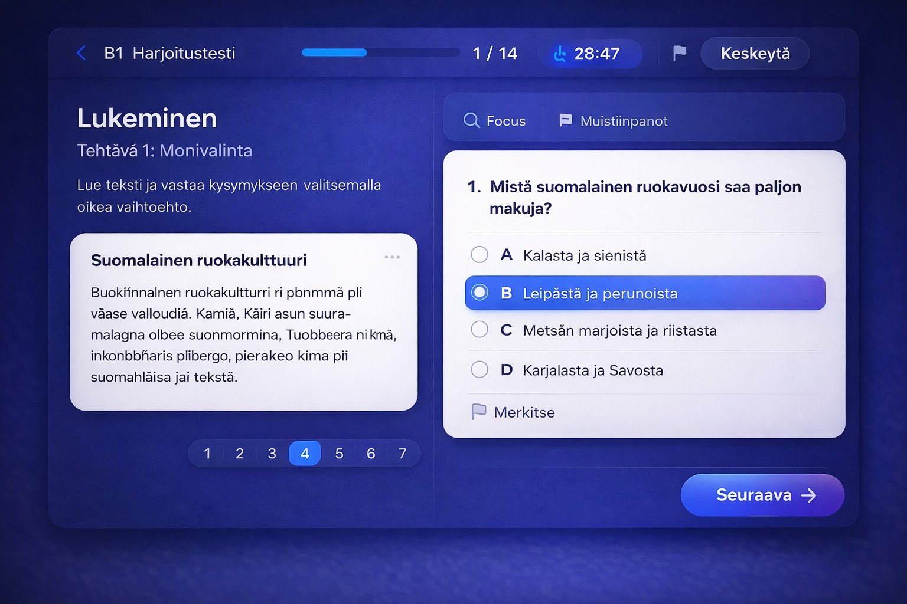

# FORENSIC_UI_REENGINEERING_SPEC

## Section 1 — Executive Finding

The original Puhis UI identity was not defined primarily by its colors. It was defined by a stable navigation shell, a repeated “dark atmospheric frame -> medium-width content card -> one primary action anchor” structure, a consistent mobile-first exam flow, and a persistent habit of presenting high-value interactions inside rounded, elevated, readable surfaces. The old app used decorative backdrops, but the real identity-bearing layer was the disciplined framing of content and the predictable placement of controls.

The current KieliTaika app is missing that framing discipline. It has improved route isolation compared with earlier phases, but it still reads as a generic system dashboard because most feature areas are rebuilt from the same small set of generic HTML primitives (`Panel`, `Button`, `Field`) rather than from domain-specific surfaces. The shell is present, but the content language inside the shell is still too uniform, too explanatory, and too structurally flat. The result is a UI that is technically routed, but not yet visually governed by one product grammar.

What must be restored from the old app:

- Stable screen-start anchors.
- One dominant interactive surface per screen family.
- Distinct feature-domain surface families that still belong to one system.
- Mobile-first exam framing with explicit header, timer/progress strip, question card, and bottom action anchor.
- White-card-on-dark-field contrast logic for learning tasks and assessments.
- Consistent radius, padding, spacing, and button emphasis rules.
- Stronger role separation between shell, content surface, and action surface.

What must remain from the new app:

- The current login screen.
- The current welcome/auth entry hierarchy.
- The current KieliTaika color direction and palette family.

Required reconstruction principle:

- Rebuild the old app’s structure, rhythm, card grammar, exam framing, and feature-specific interaction model using the current KieliTaika palette rather than the old literal blue/purple values.

Evidence confidence:

- Original navigation and shell model: confirmed.
- Original card and exam framing grammar: confirmed.
- Current-app scatter causes: confirmed.
- Exact old motion timings: probable, inferred from component usage and screen assets rather than live runtime capture.

## Section 2 — Audit Method

### 2.1 Old app evidence sources inspected

Routes and shell:

- `/home/vitus/Documents/puhis/frontend/app/App.js`
- `/home/vitus/Documents/puhis/frontend/app/navigation/AppNavigator.tsx`
- `/home/vitus/Documents/puhis/frontend/app/navigation/RootNavigator.tsx`
- `/home/vitus/Documents/puhis/frontend/app/components/CustomDrawerContent.js`
- `/home/vitus/Documents/puhis/frontend/app/components/PremiumBottomNav.js`

Design system and shared theme:

- `/home/vitus/Documents/puhis/frontend/design_system/colors.ts`
- `/home/vitus/Documents/puhis/frontend/design_system/spacing.ts`
- `/home/vitus/Documents/puhis/frontend/design_system/typography.ts`
- `/home/vitus/Documents/puhis/frontend/design_system/radius.ts`
- `/home/vitus/Documents/puhis/frontend/app/exam_runtime/theme.ts`
- `/home/vitus/Documents/puhis/frontend/app/components/ui/Background.tsx`
- `/home/vitus/Documents/puhis/frontend/app/components/ui/RukaCard.js`

Screen families:

- `/home/vitus/Documents/puhis/frontend/app/screens/HomeScreen.js`
- `/home/vitus/Documents/puhis/frontend/app/screens/PracticeScreen.tsx`
- `/home/vitus/Documents/puhis/frontend/app/screens/RoleplayScreen.js`
- `/home/vitus/Documents/puhis/frontend/app/screens/WorkplaceScreen.js`
- `/home/vitus/Documents/puhis/frontend/app/screens/YKIScreen.js`
- `/home/vitus/Documents/puhis/frontend/app/screens/YKIInfoScreen.js`
- `/home/vitus/Documents/puhis/frontend/app/exam_runtime/screens/ExamRuntimeScreen.tsx`
- `/home/vitus/Documents/puhis/frontend/app/exam_runtime/screens/ResultsOverviewScreen.tsx`
- `/home/vitus/Documents/puhis/frontend/app/exam_runtime/components/PageContainer.tsx`
- `/home/vitus/Documents/puhis/frontend/app/exam_runtime/components/PrimaryButton.tsx`
- `/home/vitus/Documents/puhis/frontend/app/exam_runtime/components/ContentCard.tsx`
- `/home/vitus/Documents/puhis/frontend/app/exam_runtime/components/ExamProgressBar.tsx`

### 2.2 Current app evidence sources inspected

- `/home/vitus/kielitaika/frontend/app/App.tsx`
- `/home/vitus/kielitaika/frontend/app/components/AppShell.tsx`
- `/home/vitus/kielitaika/frontend/app/components/Panel.tsx`
- `/home/vitus/kielitaika/frontend/app/components/Button.tsx`
- `/home/vitus/kielitaika/frontend/app/screens/AuthScreen.tsx`
- `/home/vitus/kielitaika/frontend/app/screens/DashboardScreen.tsx`
- `/home/vitus/kielitaika/frontend/app/screens/CardsScreen.tsx`
- `/home/vitus/kielitaika/frontend/app/screens/RoleplayScreen.tsx`
- `/home/vitus/kielitaika/frontend/app/screens/VoiceStudioScreen.tsx`
- `/home/vitus/kielitaika/frontend/app/screens/YkiIntroScreen.tsx`
- `/home/vitus/kielitaika/frontend/app/screens/YkiExamScreen.tsx`
- `/home/vitus/kielitaika/frontend/app/screens/YkiResultScreen.tsx`
- `/home/vitus/kielitaika/frontend/app/theme/global.css`
- `/home/vitus/kielitaika/frontend/app/theme/backgrounds.ts`
- `/home/vitus/kielitaika/frontend/app/theme/tokens.css`

### 2.3 Screenshot evidence captured from the old UI archive

The following old-UI screenshots were copied into this repo for stable audit references:

- `docs/audit/forensic_ui_reengineering_assets/old_ui_yki_full_app_flow.png`
- `docs/audit/forensic_ui_reengineering_assets/old_ui_mobile_web_flow.png`
- `docs/audit/forensic_ui_reengineering_assets/old_ui_card_front_back.png`
- `docs/audit/forensic_ui_reengineering_assets/old_ui_professional_finnish.png`
- `docs/audit/forensic_ui_reengineering_assets/old_ui_exam_result_strip.png`
- `docs/audit/forensic_ui_reengineering_assets/old_ui_web_reading.png`
- `docs/audit/forensic_ui_reengineering_assets/old_ui_yki_exam_complete.png`

Embedded screenshot evidence:

### 2.4 Runtime and render validation

- The old app was not fully re-run in this pass.
- Visual evidence came from archived screen captures in the old repo and from source inspection of the old React Native navigation and runtime components.
- Responsive evidence was derived from:
  - the archived combined mobile/web flow image,
  - the old drawer navigator and web guide,
  - the old exam runtime component hierarchy.
- This means:
  - mobile shell and exam flow are confirmed,
  - desktop exam framing is confirmed,
  - exact interactive animations are probable rather than directly runtime-captured.

## Section 3 — Original App UI Identity Profile

### 3.1 Shell

Confirmed pattern:

- The original app always treated navigation as a structural authority, not a convenience layer.
- `AppNavigator` separated auth, onboarding, and main application graphs.
- `RootNavigator` separated home, YKI, work, practice, conversation, and settings into explicit route families.
- The drawer was not decorative. It was the stable access spine for the product.

Identity-bearing shell laws:

- One active screen family at a time.
- Main route groups corresponded to major product modes, not arbitrary page bundles.
- Deep flows, especially YKI, used nested stacks inside a stable route family.
- Locked states remained inside the same route graph via dedicated locked surfaces rather than dissolving the shell.

### 3.2 Hierarchy

Confirmed pattern:

- Screens usually started with a compact header or a hero card, then moved into one primary content surface, then one primary action area.
- The old app avoided wide, low-importance content carpets. It preferred distinct content blocks with clear start points.
- Even when screens contained multiple cards, they still read as one composition with an obvious first focal element.

### 3.3 Navigation model

Confirmed pattern:

- Mobile:
  - drawer navigation for global movement,
  - explicit back/home controls in deep screens,
  - exam flows behaved as linear sequences.
- Web:
  - same exam logic, but translated into wider split layouts instead of full redesign.

The old app felt coherent because navigation and content started from predictable anchors. The user always knew:

- where the global menu lived,
- where the top title lived,
- where the primary progress indicator lived,
- where the next-step button lived.

### 3.4 Spacing model

Confirmed pattern:

- Shared token references point to an 8px grid base.
- Repeated card padding is 24.
- Repeated page margin is 24.
- Repeated card radius is 16.

Observed effect in screenshots:

- Internal content breathing room is medium, not airy.
- Actions are close enough to feel connected to their content cards.
- Cards are separated consistently, with no abrupt jumps between 12, 30, 46, and 80-style spacing families.

### 3.5 Typography

Confirmed pattern:

- The old app used clear contrast between:
  - large task/screen title,
  - medium section title,
  - readable body,
  - compact helper or meta text.
- Token file defines heading `28`, body `18`, option `17`, line-height `1.6`.
- Screenshots confirm relatively generous body sizing for learning content and answer options.

Typography behavior:

- Titles were short and direct.
- Meta text was compact, often in pills or top bars.
- Helper text supported the task rather than explaining the app’s architecture.

### 3.6 Card model

Confirmed pattern:

- Cards were the dominant UI unit.
- Card surfaces were rounded, elevated, and readable.
- Practice cards and exam cards used different proportions, but belonged to the same family:
  - bright readable content surfaces,
  - restrained border presence,
  - soft shadow depth,
  - clear action docking.

The old card model was not generic. It had three distinct families:

- Content cards:
  - white or near-white, used for reading passages, questions, forms.
- Glass-dark info cards:
  - dark translucent surfaces on dark atmospheric backgrounds.
- Feature cards:
  - module launchers or info panels with stronger framing and clear tap affordance.

### 3.7 Surfaces

Confirmed pattern:

- Backgrounds provided atmosphere.
- Cards carried the actual work.
- Headers and progress strips were lighter-weight framing layers.

This is the crucial old-app law:

- The background set mood.
- The card delivered the task.
- The button committed the action.

### 3.8 Motion

Probable pattern:

- Subtle fades and screen transitions existed.
- Motion supported state changes, drawer appearance, and interaction response.
- The old app did not rely on flashy full-screen transitions to create identity.

Likely motion language:

- short fades,
- press feedback,
- small lift/glow or highlight,
- controlled drawer and stack transitions,
- no chaotic micro-motion on task-heavy screens.

### 3.9 Interaction style

Confirmed pattern:

- Primary action was always obvious.
- Secondary actions were present but visually subordinate.
- Long-form tasks emphasized legibility over ornament.
- Exam flows constrained the interaction graph so users progressed linearly.
- Practice flows centered the single current card.

### 3.10 Information density

Confirmed pattern:

- The old app was medium-density.
- It did not collapse into giant empty hero layouts.
- It did not overload every screen with dashboards, logs, JSON, and system state.
- It used enough density to feel serious and task-oriented.

### 3.11 Emotional and product tone

Confirmed pattern:

- Supportive, disciplined, educational.
- Premium but not luxurious in a decorative-first way.
- Calm, guided, focused on task completion.

Educational tone:

- “Here is your task.”
- “Here is the progress.”
- “Here is the next action.”

Not:

- “Here is a system explanation.”
- “Here is infrastructure status.”

## Section 4 — Current New App Scatter Diagnosis

### 4.1 Shell inconsistency has been reduced, but content grammar is still inconsistent

The current app now has a single shell in `App.tsx` and `AppShell.tsx`. That fixed the earlier continuous-flow problem. However, inside that shell, the feature screens still do not behave like members of one product family.

Specific cause:

- The shell is centralized.
- The feature surfaces are not.

### 4.2 Generic primitive overuse is flattening domain identity

Confirmed issue:

- `Panel`, `Button`, `Field`, and `StatusBanner` are reused almost everywhere.
- Practice, conversation, voice, and YKI intro/result all read as “generic admin panels with different data” rather than purpose-built learning surfaces.

Consequence:

- The old app had distinct surface families for practice, exam, roleplay, and modules.
- The new app turns too many screens into the same card-with-form grammar.

### 4.3 Current copy leaks system structure into the product surface

Confirmed examples:

- `DashboardScreen.tsx` still contains “Active screen shell”.
- `YkiIntroScreen.tsx` says “YKI Flow”.
- `VoiceStudioScreen.tsx` references “KAIL-style explicit start and stop”.
- `DashboardScreen.tsx` and `RoleplayScreen.tsx` describe backend behavior instead of user tasks.

Consequence:

- The old app framed tasks.
- The new app often frames implementation.

### 4.4 The current home screen is structurally cleaner than before, but still not old-app coherent

Confirmed issue:

- `DashboardScreen.tsx` is now bounded inside one surface, which is correct.
- But it is still a technical dashboard made of feature descriptions and subscription metadata.

Why that feels scattered:

- The old home routed users into their active plan and progress context.
- The new home still describes product modules as if the user is evaluating system capabilities.

### 4.5 The current practice runtime improved shape control, but not enough of the old practice language is present

Confirmed improvements:

- card ratio is now locked,
- runtime branch is isolated,
- centered-card composition exists.

Remaining scatter:

- The card exists, but the surrounding screen still lacks the old app’s clean “single card in a soft atmospheric field” calm.
- The current implementation still reads as a reconstructed component rather than the authoritative learning surface.

### 4.6 YKI runtime fidelity is still low relative to the old app

Confirmed issue:

- Old app exam runtime had a dedicated component family:
  - `AppHeader`,
  - `PageContainer`,
  - `ContentCard`,
  - `ExamProgressBar`,
  - result/review/certificate screens.
- Current app YKI runtime is handled largely inside one large `YkiExamScreen.tsx` with generic buttons and panels.

Consequence:

- The old app’s exam surface hierarchy is not being translated.
- The new app technically runs the flow, but visually it does not yet resemble the old exam system closely enough.

### 4.7 Width and framing discipline are still uneven

Confirmed issue:

- The current shell has width caps.
- But inner screen families do not all have their own authoritative width and framing rules.
- Some screens feel card-centered, some feel panel-grid centered, some feel form-driven, and some feel like debugging consoles.

### 4.8 Background authority exists, but background contribution to hierarchy is weaker than in the old app

Confirmed issue:

- `backgrounds.ts` correctly centralizes backgrounds.
- However, the current shell and panel surfaces often mute the atmospheric layer to the point where it stops contributing meaningful hierarchy.

Old-app law:

- Background sets context.

Current issue:

- Background is sometimes present, but not compositionally active.

### 4.9 State design is incomplete

Confirmed issue:

- The old app had identifiable loading, locked, active, result, review, and certificate states with dedicated visual treatment.
- The new app still falls back to:
  - inline error cards,
  - generic status banners,
  - generic loading copy,
  - JSON previews in user-facing screens.

### 4.10 Scatter summary

The current new app feels scattered because it is correct at the routing level but still generic at the surface level. The old app’s coherence came from repeating the same structural laws across different feature domains while allowing each domain to have its own surface form. The new app currently repeats components more than it repeats UI laws.

## Section 5 — Screen-by-Screen Reverse-Engineering Map

### 5.1 Auth entry

Original purpose:

- welcome, login, registration, onboarding transition.

Original structure:

- clear mobile-first auth card,
- dominant logo or welcome framing,
- direct action pair,
- provider options beneath the primary path.

Current rule:

- Keep the current KieliTaika login and welcome hierarchy.

Rebuild instruction:

- Preserve current auth screen conceptually.
- Only align its spacing and component finish with the rest of the reconstructed system.

### 5.2 Home/dashboard

Original purpose:

- route the user into their active path,
- show limited progress context,
- avoid acting as a technical dashboard.

Original layout structure:

- one main hero/instruction surface,
- limited supporting progress cards,
- drawer as the real global navigation spine.

Original visual treatment:

- dark atmospheric background,
- one or two elevated cards,
- clear top start point,
- not a dense feature grid.

Current problem:

- current home explains modules and entitlements rather than orienting a learner.

Rebuild instruction:

- Replace feature-description grid with:
  - active learning path card,
  - next recommended action,
  - progress summary,
  - limited secondary shortcuts.
- Keep current palette, not old colors.
- Maintain bounded single-surface composition on mobile.

### 5.3 Practice/cards

Original purpose:

- centered, single-card recall flow with explicit recall, audio, skip, and progress.

Original layout structure:

- top utility row,
- centered portrait card,
- bottom progress dots,
- one bottom action anchor.

Original visual treatment:

- bright, almost paper-white card,
- soft blue atmospheric field,
- minimal text on the front,
- answer side with clean divider logic,
- restrained border/shadow system.

Current keep:

- one active card at a time,
- backend-authored card state,
- isolated runtime branch.

Current change:

- remove any residual generic-panel feel around the runtime,
- make the surrounding stage calmer and more singular,
- ensure intro screen and runtime feel like members of the same practice family.

Rebuild instruction:

- Practice runtime becomes an authoritative screen family with:
  - dedicated header bar,
  - dedicated stage surface,
  - dedicated card shell,
  - dedicated bottom progression strip.
- No generic `Panel` usage in this family.

### 5.4 Conversation/roleplay

Original purpose:

- turn-based spoken interaction inside a guided conversational frame.

Original layout structure:

- scenario header,
- transcript or turn history surface,
- dedicated mic/input zone,
- explicit progression.

Original visual treatment:

- dark immersive surface,
- speech-focused card and bubble hierarchy,
- input controls feel instrument-like, not form-like.

Current problem:

- current `RoleplayScreen.tsx` reads like a backend console:
  - scenario id field,
  - level field,
  - transcript loader,
  - review loader,
  - JSON preview.

Rebuild instruction:

- Replace configuration-first layout with session-first layout.
- Start with scenario chooser or current scenario summary.
- Give transcript area a chat or guided-turn surface family.
- Remove JSON previews from user-facing roleplay flow.

### 5.5 Professional Finnish

Original purpose:

- module selection and profession-focused practice.

Original layout structure:

- profile/header area,
- selected profession identity,
- stacked or grouped module cards.

Original visual treatment:

- dark premium surfaces,
- profile-led top region,
- card list with icon + label + description.

Current problem:

- current professional area is just `VoiceStudioScreen` with relabeled props.

Rebuild instruction:

- Restore profession-driven module hub first.
- Voice tools become a sub-surface, not the entire professional section.

### 5.6 YKI intro

Original purpose:

- select level,
- understand exam start state,
- begin the exam.

Original layout structure:

- simple header,
- hero/intro card,
- level selection cards,
- action footer.

Original visual treatment:

- dark field with light action anchor,
- compact explanatory copy,
- clear selected-state cards.

Current problem:

- structure exists, but copy and surface behavior are still technical.

Rebuild instruction:

- Keep one-screen intro model.
- Replace system wording with exam wording.
- Translate old intro composition into current palette.

### 5.7 YKI runtime

Original purpose:

- behave like a real assessment environment.

Original layout structure:

- fixed exam header,
- timer/progress,
- task content area,
- answer area,
- bottom action anchor or right action zone on web.

Original visual treatment:

- content-heavy white cards on dark field,
- very clear hierarchy between prompt and answer,
- strong positional consistency between sections.

Current problem:

- current runtime is functional but visually monolithic.
- too much of the section logic lives in one generic rendering system.

Rebuild instruction:

- Break YKI runtime into dedicated surface primitives:
  - exam header,
  - progress bar,
  - prompt card,
  - question/answer card,
  - speaking capture card,
  - review strip,
  - result cards.
- The runtime must no longer visually resemble a large generic panel.

### 5.8 YKI results/review/certificate

Original purpose:

- convert raw performance into a calm, trustworthy summary.

Original layout structure:

- score card,
- section breakdown,
- next-step action,
- certificate as its own ceremonial surface.

Original visual treatment:

- dark frame,
- central white score surfaces,
- progress dots or breakdown matrix,
- dignified certificate card.

Current problem:

- current result screen is still metadata plus optional raw certificate payload.

Rebuild instruction:

- Replace metadata grid with:
  - score summary card,
  - section breakdown card,
  - review access,
  - certificate preview card.

### 5.9 Settings/account

Original purpose:

- profile and preference management under the same shell.

Original layout structure:

- profile card,
- grouped settings rows,
- clear secondary control language.

Rebuild instruction:

- Continue to expose settings via the main shell.
- Use row-group cards rather than dashboard panels.

### 5.10 Locked/premium states

Original purpose:

- preserve shell continuity while denying access.

Original treatment:

- dedicated locked feature surface with concise message.

Rebuild instruction:

- locked states must remain on-brand and within shell.
- no plain inline error paragraph in the middle of another screen.

## Section 6 — Component Reconstruction Matrix

### 6.1 Primary button

- Role: commit primary next step.
- Where used: start exam, continue, submit, next, begin practice.
- Old behavior: bold, obvious, single main action per screen zone.
- Old visual characteristics: pill or rounded-rectangle, gradient emphasis, high contrast.
- New-app reconstruction rules: use KieliTaika cyan/blue palette, preserve strong filled treatment, minimum height 48, anchored consistently at bottom or action row.
- Required states: default, hover, pressed, disabled, loading.
- Responsive behavior: full-width on mobile task screens, intrinsic width inside desktop action bars.
- Accessibility: visible focus ring, strong contrast, minimum 44px target.
- Must not be altered: hierarchy priority over secondary buttons.

### 6.2 Secondary button

- Role: alternate path without stealing primary emphasis.
- Where used: resume, back, info, load transcript, alternative navigation.
- Old behavior: outlined or lighter filled surface.
- New rule: never equal visual weight to primary action.

### 6.3 Icon button

- Role: audio, flip, drawer, notes, focus, flag.
- Old behavior: compact circular or rounded-pill controls with clear affordance.
- New rule: icon buttons must belong to the screen family they live in; avoid generic button styling.

### 6.4 Global navigation shell

- Role: persistent route authority.
- Where used: drawer/sidebar/mobile nav.
- Old behavior: profile, route list, theme/logout bottom area.
- New rule: sidebar must preserve current app shell investment, but its internal composition should follow the old drawer’s profile-first, route-second, utility-last ordering.

### 6.5 Section header

- Role: establish the screen start point.
- Old behavior: compact but clear; often paired with back/home affordance.
- New rule: every major screen family gets a domain-specific section header. Do not let all screens inherit the same panel-title pattern.

### 6.6 Card shell

- Role: carry readable content against atmospheric backgrounds.
- Old behavior: rounded, elevated, medium padding, consistent depth.
- New rule: define exactly three card families:
  - dark glass info card,
  - light content card,
  - launcher/module card.

### 6.7 Modal/drawer

- Role: temporary navigation or focus mode.
- Old behavior: drawer slides in from edge with dark overlay.
- New rule: mobile drawer must preserve current responsive shell but visually align to old drawer proportions and internal spacing.

### 6.8 Prompt container

- Role: present reading/listening/writing prompt.
- Old behavior: white card with generous text padding.
- New rule: prompt containers must not be generic panels; they are task surfaces.

### 6.9 Practice card

- Role: single active study object.
- Old behavior: portrait, centered, minimal, strongly readable.
- New rule: preserve fixed portrait ratio, local card authority, top utility controls, bottom progression strip, minimal chrome.

### 6.10 Exam question frame

- Role: present answerable task in a controlled assessment environment.
- Old behavior: paired prompt/answer zones on web, stacked zones on mobile.
- New rule: define separate mobile and desktop compositions without changing the underlying task grammar.

### 6.11 Audio control surface

- Role: play audio or prompt.
- Old behavior: clear, compact, embedded into task card.
- New rule: keep audio control close to the content it affects.

### 6.12 Mic button surface

- Role: speaking capture.
- Old behavior: large focal control with clear active/inactive state.
- New rule: speaking capture controls must feel like recording instruments, not generic submit buttons.

### 6.13 Result panel

- Role: summarize score or progress outcome.
- Old behavior: centered, trustworthy, high-contrast.
- New rule: use layered summary cards and section breakdowns rather than raw metadata grids.

### 6.14 Premium lock surface

- Role: deny access without breaking shell.
- Old behavior: dedicated locked card.
- New rule: keep access denial inside a composed card with one call to action.

### 6.15 Progress strip

- Role: tell the user where they are in a flow.
- Old behavior: fixed top progress bar or bottom dot strip depending on mode.
- New rule: choose one progress mode per screen family and keep it stable.

### 6.16 Tabs/chips/toggles

- Role: secondary selection tools.
- Old behavior: compact, readable, clearly selected.
- New rule: they cannot replace primary navigation and cannot become visually louder than main actions.

### 6.17 List item rows

- Role: settings, notes, breakdown, profession options.
- Old behavior: grouped row cards with clear text hierarchy.
- New rule: settings and list content should use grouped rows, not dashboard tiles.

## Section 7 — Visual Token Translation Layer

The old app’s identity should be preserved through structure, not literal color transfer.

### 7.1 Primary surfaces

- Old structure: readable bright card on dark atmospheric field.
- New translation: use KieliTaika near-white or pale frosted surface as the content plane, with KieliTaika cyan-blue accents for primary selection and emphasis.

### 7.2 Secondary surfaces

- Old structure: dark translucent support cards.
- New translation: use current `--surface`, `--surface-strong`, and `--surface-soft` values for non-primary information surfaces, but normalize opacity and border behavior so all dark cards look related.

### 7.3 Background layers

- Old structure: atmospheric but subordinate.
- New translation: backgrounds must remain decorative context, never the readability layer. Decorative intensity should be strongest on auth, home, conversation, and professional hub; reduced on practice and removed on YKI task screens.

### 7.4 Contrast strategy

- Old structure: dark field -> bright task surface -> saturated action.
- New translation: preserve three-layer contrast:
  - background,
  - card,
  - action emphasis.

### 7.5 Border strategy

- Old structure: subtle borders, mostly there to sharpen light surfaces and dark glass edges.
- New translation: use current border cyan softly, but reduce random border variety. Each card family gets exactly one border opacity rule.

### 7.6 Action emphasis

- Old structure: one strong filled action, one lighter alternative.
- New translation: current cyan/blue palette replaces old blue/purple gradient, but the hierarchy remains identical.

### 7.7 Info/warning/error/success mapping

- Old structure: status colors embedded inside calm surfaces, not full-screen alarm states.
- New translation:
  - success uses current green,
  - error uses current red,
  - warning uses a restrained amber,
  - info uses cyan accents,
  - all state colors stay inside card language.

### 7.8 Selected and hover states

- Old structure: selected items brighten and fill subtly; hover is supportive, not dominant.
- New translation: keep selection emphasis luminous and directional, avoid heavy scale or neon glow.

### 7.9 Disabled states

- Old structure: obvious but still readable.
- New translation: reduce opacity and contrast while retaining legible text and structural shape.

### 7.10 Dark/light implications

- Original screenshots show dark-mode dominance.
- New repo may retain dark/light awareness, but reconstruction should optimize for dark-first compositional fidelity because that is where the old identity is strongest.

## Section 8 — Layout and Spacing Reconstruction Rules

### 8.1 Spacing scale

- Base unit: 8.
- Allowed core rhythm: 8, 16, 24, 32.
- Large section breaks: 40 only where needed for hero-to-body separation.

### 8.2 Page gutters

- Mobile page gutter: 16 to 20.
- Desktop content gutter inside bounded surfaces: 24.
- Shell frame padding on large screens: 24 to 32, never zero.

### 8.3 Section spacing

- Header to primary surface: 16 or 24.
- Surface to surface within same screen: 16 or 24.
- Screen-family transition spacing must not drift across pages.

### 8.4 Card padding

- Light task cards: 24.
- Dark info cards: 20 to 24.
- Compact utility cards: 16.

### 8.5 Inter-component spacing

- Title to body: 8.
- Body to control group: 16.
- Control to control in same group: 8 or 12.
- Surface footer action dock: 16 above button row.

### 8.6 Max widths

- Shell max: 1360 is acceptable in current repo.
- General content max inside shell: around 980 to 1120.
- Practice stage max: 980.
- Practice card width: fixed authority, portrait ratio.
- Exam content on desktop: split layout, not full-width sprawl.

### 8.7 Mobile stacking rules

- One dominant card or one dominant stacked pair.
- Header first, content second, action third.
- Do not let multiple unrelated panels stack into a long page without a compositional frame.

### 8.8 Desktop panel rules

- Desktop should widen relationships, not invent a new screen language.
- Exam screens may split prompt and answer zones side by side.
- Dashboard/home should remain bounded, not become a wide admin canvas.

### 8.9 Height behavior

- Shell owns viewport height.
- Main route stage owns content height.
- Screen family decides whether content centers or scrolls.
- Practice and exam task screens should prioritize fixed compositional balance before long scrolling.

### 8.10 Sticky/fixed region usage

- Drawer/sidebar persists.
- Exam header and progress should feel fixed or strongly anchored.
- Bottom action dock may remain visually anchored on mobile task screens.

### 8.11 Scroll containment rules

- Shell scroll and page scroll must not compete.
- Task-heavy screens should scroll within the content region, not through stacked global chrome.
- No nested uncontrolled scroll regions unless there is a clear task reason.

## Section 9 — Motion and Transition Reconstruction Rules

### 9.1 Old-app motion character

Probable motion laws:

- quick fade-in for screens,
- press feedback on buttons and cards,
- drawer slide,
- subtle state change animation for progress and selected options,
- no theatrical transitions inside exam tasks.

### 9.2 Timing ranges

- Screen enter: 180 to 260ms.
- Press feedback: 80 to 140ms.
- Drawer open/close: 180 to 220ms.
- Progress change: 160 to 220ms.

### 9.3 Easing style

- Smooth ease-out for enter.
- Short ease-in-out for drawer and selection transitions.
- Avoid bouncy spring motion on exam and settings surfaces.

### 9.4 Where transitions should happen

- route change,
- drawer open/close,
- card flip,
- answer selection,
- progress advancement,
- lock/unlock or success reveal.

### 9.5 When motion should be suppressed

- active exam answering,
- reading comprehension screens,
- writing screens,
- error or connectivity fallback states.

### 9.6 What to avoid

- heavy floating panels,
- parallax for primary task surfaces,
- unrelated micro-animations on every card,
- motion that makes screens feel gamified when they should feel assessment-oriented.

## Section 10 — Controlled Deviations Register

### 10.1 Preserve current login screen

- Difference from original: current KieliTaika auth is retained.
- Reason: explicit project constraint.
- Type: product constraint.
- Minimize difference: align only spacing and finish with reconstructed system.

### 10.2 Preserve current welcome page concept

- Difference from original: new welcome/auth hierarchy stays.
- Reason: explicit project constraint.
- Type: product constraint.
- Minimize difference: keep same hierarchy, only normalize spacing/material finish if needed.

### 10.3 Keep current color palette

- Difference from original: old blue/purple/brown literal palette not restored.
- Reason: explicit project constraint.
- Type: branding constraint.
- Minimize difference: preserve structure and contrast hierarchy from the old app.

### 10.4 Current web shell can remain HTML/CSS-native

- Difference from original: old app was React Native / Expo first.
- Reason: current architecture is web-first React.
- Type: technical.
- Minimize difference: reproduce layout laws, not widget internals.

### 10.5 Responsive drawer implementation may differ technically

- Difference from original: implementation method differs.
- Reason: architecture.
- Type: technical.
- Minimize difference: preserve visual order, overlay behavior, and route stability.

## Section 11 — Implementation Blueprint for the New Repo

### 11.1 Layout primitives that should exist

- `ShellFrame`
- `SidebarNav`
- `ScreenHeader`
- `DarkInfoCard`
- `LightTaskCard`
- `ModuleLauncherCard`
- `ActionDock`
- `ProgressStrip`
- `ExamHeader`
- `ExamPromptCard`
- `ExamAnswerCard`
- `ResultSummaryCard`
- `CertificatePreviewCard`

### 11.2 Component primitives that should exist

- `PrimaryActionButton`
- `SecondaryActionButton`
- `IconActionButton`
- `SelectionPill`
- `OptionRow`
- `SettingsRow`
- `DrawerProfileCard`
- `TaskProgressDots`
- `MicSurface`

### 11.3 Pages to normalize first

1. Home/dashboard.
2. Professional Finnish hub.
3. Conversation.
4. Practice runtime and practice intro.
5. YKI intro.
6. YKI runtime.
7. YKI result/review/certificate.
8. Settings.

### 11.4 Styling source that should become authoritative

- Keep `backgrounds.ts` authoritative for backgrounds.
- Split `global.css` into:
  - shell,
  - primitives,
  - screen-family layers.
- Introduce screen-family CSS modules or dedicated files so practice, conversation, professional, and YKI stop depending on one generic panel language.

### 11.5 How to prevent scatter from returning

- Forbid feature screens from shipping with raw JSON preview in user-facing mode.
- Forbid generic `Panel` usage in practice runtime and YKI runtime families.
- Require one declared dominant surface per screen family.
- Require one screen-start anchor pattern per screen family.
- Add screenshot-based regression checks for:
  - practice,
  - conversation,
  - professional hub,
  - YKI intro,
  - YKI runtime mobile,
  - YKI runtime desktop,
  - results.

### 11.6 What should be centralized

- spacing scale,
- card families,
- action hierarchy,
- header patterns,
- progress patterns,
- status treatments,
- route-family shell rules.

### 11.7 What should remain local

- task-specific content inside practice and YKI,
- conversation transcript composition,
- profession module content,
- exam section-specific controls.

### 11.8 What should be removed

- system-facing explainer copy from user screens,
- user-facing JSON previews,
- domain misuse of generic `Panel` for authoritative task surfaces,
- dashboard language that describes implementation rather than learning actions.

## Section 12 — Priority Order

1. Shell normalization refinement.
2. Card-family primitive split.
3. Header and action-dock normalization.
4. Home and professional-hub reconstruction.
5. Conversation reconstruction.
6. Practice family reconstruction.
7. YKI intro reconstruction.
8. YKI runtime reconstruction.
9. Result/review/certificate reconstruction.
10. Settings row-group normalization.
11. Motion pass.
12. Screenshot regression pass.

Rationale:

- The shell is already partly repaired. The next failure point is the absence of domain-specific surface families.
- YKI should not be rebuilt before the supporting card/header/progress primitives exist.

## Section 13 — Acceptance Criteria

### 13.1 Visual similarity criteria

- The rebuilt app clearly reads as the old Puhis app’s structural descendant within one screenful.
- Practice looks like a centered single-card learning screen, not a form panel.
- YKI looks like an exam environment, not a generic route with buttons and metadata.
- Professional Finnish looks like a profession/module hub, not a relabeled voice utility page.

### 13.2 Layout consistency criteria

- Every screen family has one dominant surface.
- Screen-start anchors are consistent within each family.
- Width caps and action docking are predictable.
- Shell and content never collapse into one long undifferentiated flow.

### 13.3 Interaction consistency criteria

- Primary and secondary actions behave consistently.
- Drawer behavior is stable on mobile.
- Task progression always has one obvious next action.
- Audio and speaking controls feel purpose-built.

### 13.4 Responsiveness criteria

- Mobile task screens maintain the old app’s bounded-card feeling.
- Desktop exam screens widen into structured split layouts, not stretched stacks.
- Sidebar/drawer remains structurally identical across breakpoints.

### 13.5 Absence-of-scatter criteria

- No user-facing screen contains system-architecture explanations.
- No major task screen depends on raw JSON preview.
- No major screen family is built only from the generic panel primitive.
- Decorative backgrounds never substitute for content framing.

### 13.6 Preservation criteria

- Current login screen remains intact conceptually.
- Current welcome/auth hierarchy remains intact conceptually.
- Current KieliTaika palette direction remains intact.

## Section 14 — Non-Negotiables

- Do not replace the reconstructed shell with free-form page layouts.
- Do not let YKI runtime be visually represented by generic dashboard panels.
- Do not let conversation and professional Finnish collapse into debug-tool surfaces.
- Do not remove the current login or welcome concept.
- Do not reintroduce screen stacking or long continuous-flow compositions.
- Do not allow system/internal implementation copy onto primary user surfaces.
- Do not let backgrounds become the readability layer.

## Appendix A — Screen Inventory

Old app screen families discovered:

- Auth welcome
- Login
- Register
- Intent quiz
- Plan selection
- Profession selection
- Practice frequency
- Home
- YKI home
- YKI info
- YKI runtime
- YKI end
- Conversation
- Fluency
- Guided turn
- Shadowing
- Micro output
- Workplace
- Roleplay
- Vocabulary
- Quiz
- Lesson detail
- Notes
- Practice
- Settings
- Notification settings
- Privacy settings
- Subscription
- Exam intro
- Exam runner
- Review answers
- Submit exam
- Submission processing
- Results overview
- Detailed feedback
- CEFR level
- Certificate
- Export results
- Exam history

Current app screen families discovered:

- Auth
- Home/dashboard
- Practice
- Conversation
- Professional Finnish
- YKI intro
- YKI runtime
- YKI result
- Settings

## Appendix B — Component Inventory

Old app reusable component and pattern families discovered:

- Background
- RukaCard
- CustomDrawerContent
- PremiumBottomNav
- HomeButton
- ProgressRing
- AppHeader
- PageContainer
- PrimaryButton
- ContentCard
- ExamProgressBar
- ScoreCard
- SectionBreakdownCard
- AudioPlayer
- RecordingPanel
- SpeakingPromptCard
- WritingPromptCard
- ReadingPassageCard
- QuestionNavigator
- Toggle
- Button
- NeumorphicButton
- GlossySurface
- WavyBackground
- EnhancedCard
- Toast
- Mic button surfaces

Current app reusable component and pattern families discovered:

- AppShell
- Panel
- Button
- Field / TextAreaField
- StatusBanner
- Logo
- JsonPreview
- GlobalErrorBoundary

Inventory conclusion:

- The old app had a wider domain-specific component vocabulary.
- The current app has a narrower generic vocabulary.

## Appendix C — Visual Similarity Checklist

- Home uses one dominant learning-oriented surface, not a technical feature grid.
- Practice card is centered, portrait, calm, and visually singular.
- Conversation has a dedicated transcript/session surface and purpose-built mic/input area.
- Professional Finnish is a profession/module hub before it becomes a tool surface.
- YKI intro uses level selection cards plus a dedicated footer action card.
- YKI runtime has fixed exam header, progress strip, prompt/answer surfaces, and stable action placement.
- Results screen uses summary cards and breakdown cards rather than metadata grids.
- Card radius families are consistent.
- Primary button hierarchy is consistent.
- Backgrounds support atmosphere without competing with task cards.
- Mobile and desktop feel like the same product, not different design systems.

## Appendix D — Scatter Prevention Rules

- Every screen family must declare its dominant surface.
- Every screen family must declare its header type.
- Practice and YKI runtime may not use generic `Panel` as their primary task surface.
- User-facing screens may not include raw JSON preview outside an explicit developer mode.
- User-facing screens may not include implementation-language copy.
- New screens must map to an existing card family or define a new family explicitly.
- Width caps must be declared per screen family, not improvised locally.
- Backgrounds remain centralized and cannot be authored ad hoc.
- Screenshot regression coverage is mandatory for home, practice, conversation, professional Finnish, YKI intro, YKI runtime mobile, YKI runtime desktop, and results.
